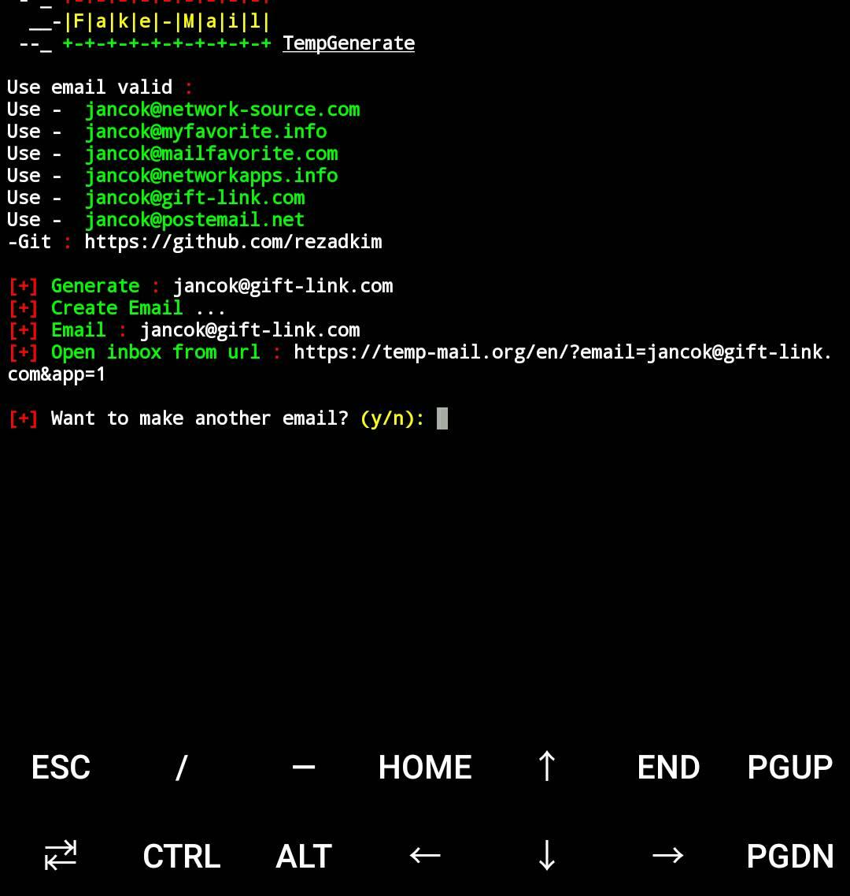

# Fake-Mail
Fake-Mail
# re upload :))
# 
' ' ' bash

$ pkg update &amp; pkg upgrade -y

$ pkg install python2

$ pkg install git

$ git clone https://www/github.com/C0PYRIGHT/Fake-Mail

$ cd Fake-Mail

$ python2 Fake-Mail.py

' ' '
